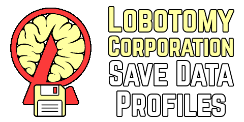

# Lobotomy Corporation Save Data Profiles Mod

A mod for the game Lobotomy Corporation that allows for creating and switching between multiple separate save files in-game. The main menu will have a new popup menu for managing save profiles.

The vanilla save files in "%UserProfile%/AppData/LocalLow/Project_Moon/Lobotomy" are left alone and used if the "default profile" is selected. Custom save profiles are saved in "LobotomyCorp/LobotomyCorp_Data/Saves".

Custom save profiles are not currently supported by Lobotomy Mod Manager's backup system; only the vanilla "default profile" will be backed up. You can make manual backups by copying your custom profile to a new profile in-game.

## License

This project is licensed under the MIT License.

## Contributing

If you find any issues or have suggestions for improvements, please open an issue or submit a pull request on [GitHub](https://github.com/Hawkbat/LobotomySaveDataProfilesMod).

## Author

Hawkbar

## Links

- [Homepage](https://github.com/Hawkbat/LobotomySaveDataProfilesMod)
- [Issues](https://github.com/Hawkbat/LobotomySaveDataProfilesMod/issues)
